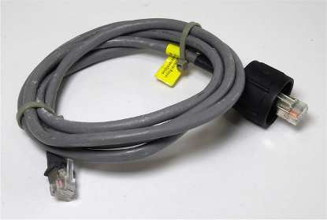
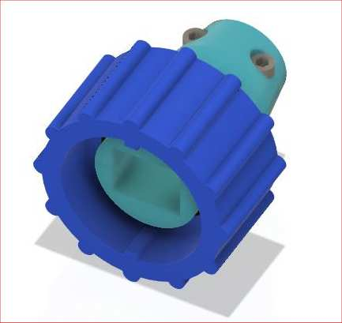
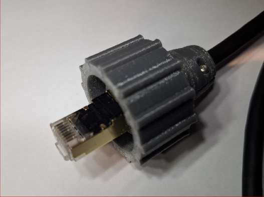
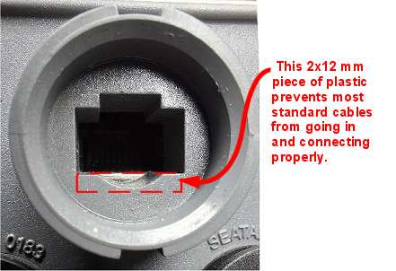
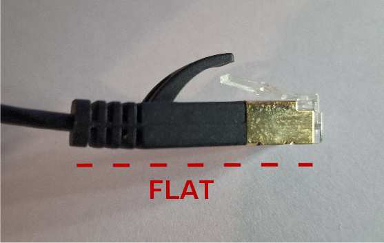
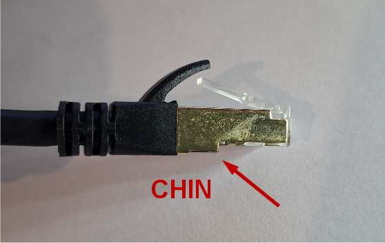
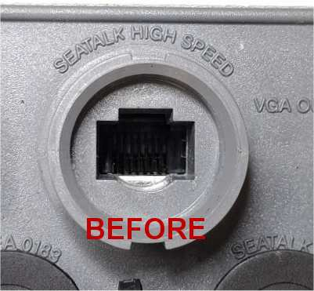
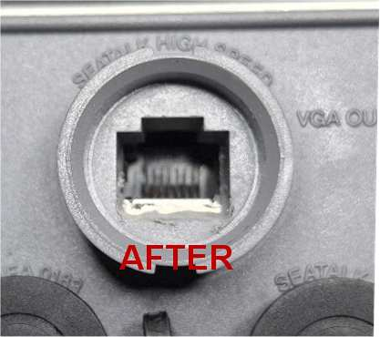
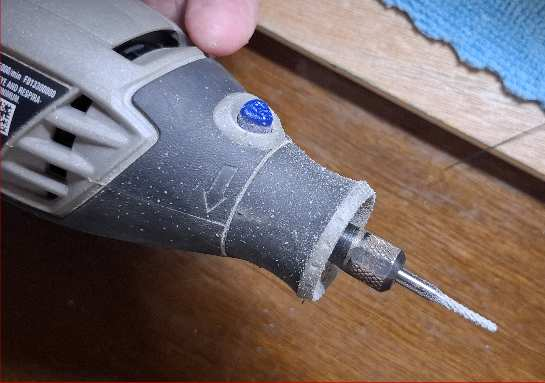

# SeatalkHS E80/E120 ethernet cables de-mystified

### The Raymarine E80 and E120 Chartplotter and the DSM300 Sonar module can use STANDARD ETHERNET CABLES.  Period.

*There is a **LOT of misinformation** on the internet about these cables
and whether or not it is possible to use standard shielded RJ45 cables
and plugs with Raymarine devices.*  This document makes it <u>unequivocally</u>
clear that it is indeed possible to use **standard shielded RJ45 ethernet
cables with these devices**.

There are two basic issues to deal with in order to use a standard CAT5/6/7/8
RJ45 **shielded** ethernet cable with these devices:

- **plug insertion depth** and making electrical contact inside the socket
- **mechanical security** of the connector is NOT provided by standard ethernet cables!

Because Raymarine did not include a *catch* for the standard RJ45 *plastic latch*,
standard ethernet cables are not securely held in place in the E80 female connector.
Please see my **field installable 3D printed Waterproof Connector** below
for my solution to the *mechanical security* of standard ethernet cables.

## Shielded Cable Required

On the E80, inside the female connector there are two spring loaded tabs
that make contact on each side with the shield when the plug is inserted.
The E80 will fail to recognize a cable that does not connect these two
spring loaded side tabs electrically.

It is important that the shielding is complete on the sides.  Most shielded
ethernet cables and connectors I have seen have sufficient contact surfaces
on each side to make good contact with the spring loaded tabs.

As far as I can tell, the DSM300 female socket DOES NOT contain such tabs, and
does not require a shielded connector

## Plug Insertion Depth

Regarding the *plug insertion depth*, the bottom line is that Raymarine put
a **bit of plastic** in their housing design that prevents most  industry standard
ethernet cables from going in far enough.

There are several approaches to getting an RJ45 plug to go deeply enough
into the female socket to make electrical contact:

- *use **flat** connectors without a **chin***
- *modify the connectors to **remove the chin***
- ***remove** the 2x12mm pieces of **plastic with a dremel***

Note that in all cases it is usually best to **cut off the black rubber finger**
protecting the *latch* to prevent it from getting in the way.
It is not generally necessary to cut off the latch itself, but
worth noting that it provides no mechanical security to actually
keep the plug attached to an E80/E120/DSM300.

### RJ45 connectors - Flat versus those with a "Chin"

It is possible to find pre-made ethernet cables with **flat** RJ45 connectors,
but almost all that are produced, including crimp-on RJ45 connectors sold separately,
have a **chin**.

**Flat connectors** will go into the E80 and make electrical contact.
**Connectors with the Chin** will not go deep enough into the female
socket to make electrical connection.  The aforementioned **piece of
plastic** catches the chin and prevents them from going in deep enough.

### Modifying connectors to remove the Chin

I have used a Dremel with a sanding drum to **remove the chin** from
a number of cables and connectors.  This solution is generally *sub-optimal*
as the metal on the chin is usually an integral part of how the shield
is connected to the clear plastic piece inside of it.  This is particularly
true of molded connectors where you cannot remove and redesign the
shield itself.
However, for crimp on connectors, with care, and a fair amount of work, it is
possible to remove the shield, grind down the plastic Chin, and modify
the shield to make new bendable tabs that hold the shield securely on the
plastic.

### Remove the piece of Plastic (Best Solution)

In the end this was the solution I chose.  The plastic that is removed
**does not affect the alignment or security** of the plug, or have anything to
do with the **waterproof connector**, so this modification *still allows for
complete use of the original Raymarine cables if desired*, but also **allows
most standard ethernet cables to plug into the E80**.

I have two E80's on my boat as well as a number of working spare units.
I modified them all as follows and have not noticed any ill effects as
a result.

I use a **Dremel with a 2mm end-mill bit** to remove the plastic.
Before I start I cram a piece of paper towel in the female socket
to minimize the amount of plastic dust that might get in there.
A *bit of care* must be taken to not mill into the metal of the
actual RJ45 female socket soldered to the printed circuit board
inside the E80. About 6mm deep of plastic must be removed.  I usually
get the rectangle down to about 1mm from the metal before gingerly
removing the last plastic.  A bit of cleanup with an exacto knife
removes the fuzzy edges left from the milling process.

## Raymarine SeatalkHS Cable Pin-outs and Wire colors

For completeness, this section includes the details about the actual
electrical connections in the E80 cable.

Note that, for all of its bulk, the Raymarine cable only has
**four conductors**. In the table Pin one is on the left with the connector facing upward
while looking at the contacts.

| E80 side | standard side | T568A colors   | T568B colors   | function                     |
|---------|----------------|----------------|----------------|------------------------------|
| 1       | 1              | white green    | white orange   | transmit +                   |
| 2       | 2              | green          | orange         | transmit -                   |
| 3       | 3              | white orange   | white green    | receive +                    |
| 4       | NC             | blue           | blue           | not used / bi-dir transmit + |
| 5       | NC             | white blue     | white blue     | not used / bi-dir transmit - |
| 6       | 6              | orange         | green          | receive -                    |
| 7       | NC             | white brown    | white brown    | not used / bi-dir transmit + |
| 8       | NC             | brown          | brown          | not used / bi-dir transmit - |

The Raymarine cables I have match the above T-568B color scheme.

Note that this a **NOT
a crossover cable!**  To produce a cross-over cable you must reverse
the receive and transmit channels on one end of the cable.

## Mechanical Security  - **field installable 3D printed Waterproof Connector**

As noted above, Raymarine did not include a **catch** for the standard RJ45 **plastic latch**
so some alternative way of holding the plug in place must be provided.

In this section I present a Waterproof Connector for SeatalkHS that I 3D printed and used
on my boat. There is an E80 in a **Pod** on the helm of my boat.  The Pod already provides
a substantial amount of protection from the elements.

In fact, the main reason for this whole readme page and all of this effort is because the
Raymarine Waterproof Connector is **too big** to pass through the cable run to the Pod.
So instead I had a standard ethernet cable (which IS small enough to run into the Pod),
where it then connected with *RJ45 Female to Female adapter*, then
to a full feet (1.5M) Standard Raymarine SeatalkHS cable which then plugs into the E80.
So, inside the Pod, I ended up with a adapter with TWO additional connections that had
to be made waterproof by wrapping them in amalgamating tape.  Not only that, but all
**five feet** of the Raymarine cable are coiled up inside the Pod as well.

So, with this solution I just do the cable run, attached the 3D printed Waterproof Connector
and plug it directly into the E80, eliminating two potential points of failure and a messy
tangle of wires.

Although this is specifically designed for use with some ethernet cables I purchased, it
should work fairly well with most run-of-the mill ethernet cables you might buy.  If not,
all of the 3D printing files, the Fusion360 design, the STL files, the Prusa Slicer files
and Gcode files are available in the
[**NET/e80_connector**](https://github.com/phorton1/base-apps-raymarine/tree/master/NET/e80_connector)
folder within this repo to allow you to customize for your particular cable or connector.

